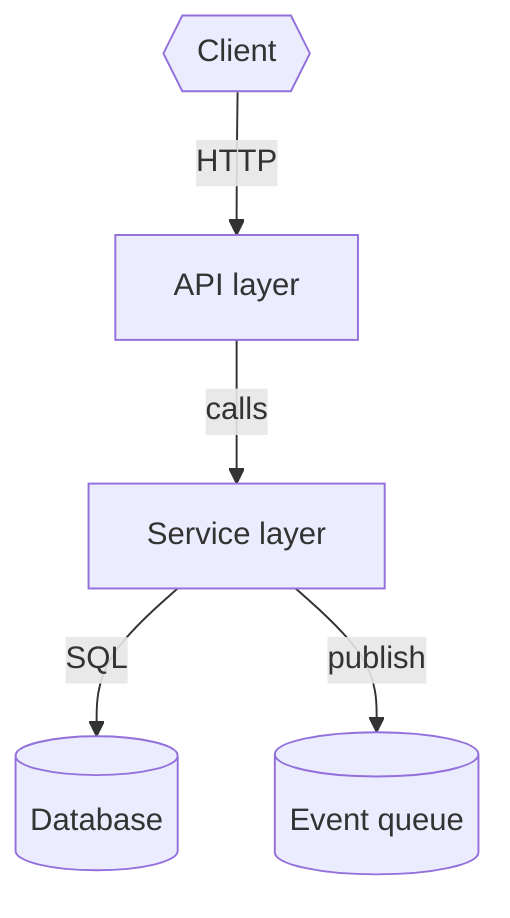

# Mode: Architecture

**Goal:** Give the reader a mental model of the system's overall structure and how the major
components relate — the map you wish someone had handed you on day one.

## What to gather

- **Entry points** — how execution starts: `main`/`cmd/`, HTTP server bootstrap, CLI root, Lambda
  handler, cron/worker entry, framework app factory.
- **Major components / modules** — the top-level building blocks and each one's responsibility.
- **Boundaries** — where one component ends and another begins (packages, services, layers).
- **Communication** — how components talk: in-process calls/imports, HTTP/gRPC, message queue/event
  bus, shared database.
- **Data stores** — databases, caches, object stores, queues, and what each holds.
- **External integrations** — third-party APIs, other internal services, auth providers.
- **Deployment shape** — process/service topology, containers, infra-as-code (Dockerfile, Helm
  chart, Terraform, k8s manifests) if present.

## How to investigate

- Read manifest/build files and top-level directories first — the layout usually mirrors the
  architecture.
- Find entry points:
  ```bash
  grep -rEn "func main|def main|app = |createApp|new Server|@SpringBootApplication|listen\(" <repo> --include=*.{go,py,js,ts,java} | head
  ```
- Follow imports/wiring from each entry point to the top layer of components. Do not go deep — you
  want breadth: who calls whom, not every function.
- Look for config that reveals dependencies: env var lists, `application.yml`, `settings.py`, IaC,
  connection strings, service discovery.
- For a large repo, fan out one `Explore` agent per top-level area; ask each for its component's
  responsibility, entry points, and outbound dependencies.

## Output structure

1. **One-paragraph summary** — what this system does and its architectural style (monolith,
   layered, microservice, event-driven, CLI tool, library, IaC module, …).
2. **Component map** — the Mermaid diagram (below).
3. **Responsibilities table** — component → responsibility → key directory/file(s) (`file:line`).
4. **Data & integrations** — data stores and external systems, with what each is used for.
5. **How a request/job flows** — 2–4 sentences tracing one representative path through the map.
6. **Where to go next** + **Open questions / gaps** (per the main workflow).

## Diagram

A `flowchart`/`graph` **component map**. Nodes = components, data stores, external systems (use
distinct shapes: `[]` component, `[( )]` datastore, `{{ }}` external). Edges labelled with the real
mechanism (HTTP, event, import, FK). Cap at ~12 nodes; collapse minor helpers into their parent.



## Common pitfalls

- Do not confuse folder names with real boundaries — verify with imports/calls.
- Do not list every file. Stay at the component altitude.
- If wiring is dynamic (DI container, plugin registry, reflection), say so and show where it is
  configured rather than guessing the graph.
