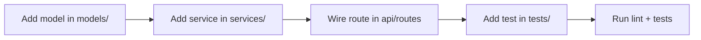

# Mode: Convention

**Goal:** Show the reader "the way things are done here" so their first contribution looks like it
belongs — the naming, layout, and idioms the maintainers expect, inferred from the code itself and
from the tooling that enforces it.

## What to gather

- **Directory & file layout** — how the tree is organised (by layer, by feature, by domain), and
  where a new file of a given kind belongs.
- **Naming patterns** — files, packages/modules, types/classes, functions, tests, constants.
- **Formatting & lint config** — `.editorconfig`, `.prettierrc`, `.eslintrc`, `ruff`/`flake8`,
  `gofmt`/`golangci-lint`, `checkstyle`/`spotless`, `.rustfmt`. These are the *enforced* rules.
- **Error handling** — how errors are created, wrapped, returned/raised, and logged.
- **Logging & observability** — the logging library and the house pattern for a log line.
- **Common idioms** — recurring patterns for config, dependency injection, validation, DTOs,
  builders, guard clauses.
- **Commit / PR conventions** — from `CONTRIBUTING.md`, PR template, commit message history, or
  `.gitmessage`.

## How to investigate

- Read config files first — they state the rules explicitly:
  ```bash
  ls -a <repo> | grep -Ei "editorconfig|prettier|eslint|ruff|flake8|golangci|checkstyle|spotless|rustfmt|contributing"
  ```
- Then confirm the rules are actually followed by sampling several real files of the same kind and
  looking for the repeated shape.
- Pick one representative "unit" (e.g. one service, one endpoint, one component) and describe it as
  the canonical example others copy.
- Prefer **frequency**: a pattern is a convention only if it recurs. Note one-offs as exceptions.

## Output structure

1. **Layout map** — where each kind of code lives (short table: kind → location → example path).
2. **Naming cheat sheet** — the pattern for each identifier kind, with one real example each.
3. **Enforced rules** — what the lint/format tooling requires (and how to run it).
4. **House idioms** — error handling, logging, config, validation — each with a real `file:line`.
5. **Recipe: "How to add a new X"** — the concrete steps to add the most common unit, based on an
   existing example. Include the diagram (below).
6. **Where to go next** + **Open questions / gaps**.

## Diagram

Either a `flowchart` of the **"how to add a new X" recipe** (the steps and files touched), or a
`graph` of the **directory layout**. Choose whichever is more useful for this repo. Base every node
on real paths.



## Common pitfalls

- Distinguish **enforced** conventions (lint config, CI) from **observed** ones (just how the code
  tends to look). Label which is which — the reader must not break an enforced rule.
- Do not present your own preference as the repo's convention. Report what the code does.
- If two areas disagree (legacy vs new), say so and note which pattern is current.
