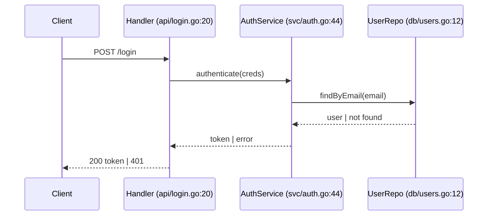

# Mode: Feature Trace

**Goal:** Map the end-to-end path of one specific feature — from where it enters the system to
where it produces its result — so the reader knows exactly which files to touch to change it.

**Requires a `target`.** If the user did not name a feature (e.g. "login", "checkout", "export CSV",
"webhook handler"), ask for one before starting.

## What to gather

- **Entry point** — where this feature starts: a route/handler, a UI action, a CLI subcommand, a
  queue consumer, a scheduled job.
- **The path** — every hop the request/data takes: entry → validation → controller/handler →
  service/business logic → data access → external calls → response/side effect.
- **Data shape** — what comes in, how it is transformed at each hop, what goes out.
- **Branches** — the main path plus the important error, empty/missing-input, and permission paths.
- **Touch points** — config, feature flags, DB tables, queues, external APIs this feature uses.

## How to investigate

- Find the entry point by searching for the feature's user-facing name, route, or command:
  ```bash
  grep -rEn "<feature-name>|/<route>|<command-name>" <repo> --include=*.{go,py,js,ts,java,rb} | head
  ```
- From the entry point, **follow the calls** one hop at a time. Open each file; confirm the next
  call target before moving on. Record `file:line` at every hop.
- Stop at true boundaries (DB query, external HTTP call, published event) — that is the end of the
  trace on that branch.
- Note where the path forks (guards, error returns, auth checks) and follow the important forks.
- For a wide feature, fan out `Explore` agents per layer, but stitch the final ordered trace
  yourself so it stays coherent.

## Output structure

1. **One-line summary** — what the feature does and where it starts.
2. **Ordered trace** — a numbered list, each step: `what happens` → `file:line`. This is the core
   deliverable.
3. **Sequence diagram** — the Mermaid diagram (below).
4. **Data at each hop** — how the payload changes from input to output.
5. **Branches** — the error / empty / permission paths and where they diverge.
6. **Where to change it** — for common change requests, which step/file to edit.
7. **Where to go next** + **Open questions / gaps**.

## Diagram

A `sequenceDiagram` of the call path. Participants = the real components/files in order. Messages =
the actual calls, labelled with the operation. Include the main return and at least one error path.



## Common pitfalls

- Do not skip hops. A trace with gaps is worse than none — if you lose the thread, say where.
- Verify each call target; do not assume a function name maps to the obvious file.
- If the path goes through dynamic dispatch (interface, event, DI), name the concrete
  implementation you believe is used and mark it as inferred if you could not confirm.
