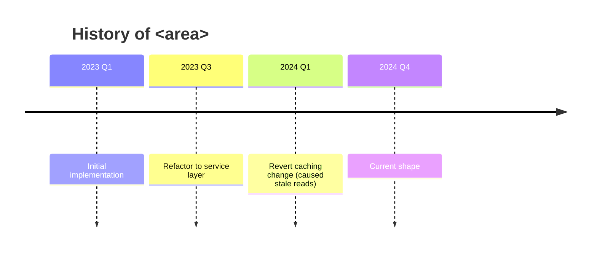

# Mode: History

**Goal:** Explain *why* an area of code looks the way it does today, using its git history — the
refactors, reversals, and decisions behind the current shape. This is the lens that turns "this
code is weird" into "this code is weird *because* …".

**Requires git.** Capability-detect first:

```bash
git -C <repo> rev-parse --is-inside-work-tree
```

If this is **not** a git repo (or history is shallow/squashed), say so plainly and give the best
account you can from other evidence (CHANGELOG, comments, docs) — do not invent a history.

## What to gather

- **Timeline of the area** — the significant commits for the target files/dir, newest to oldest,
  with the intent behind each (from the commit message).
- **Turning points** — big refactors, rewrites, reverts, and "fix the fix" sequences.
- **Hot files** — the files that change most often (churn), which signal instability or a hotspot.
- **Reasoning** — the *why* behind changes: linked issues/PRs/tickets in commit messages, and the
  problem each change was solving.
- **Ownership signal** — who has touched this area most (context for who to ask, not blame).

## How to investigate

Scope every command to the `target` path when one is given.

```bash
git -C <repo> log --oneline -n 30 -- <path>                 # recent intent, newest first
git -C <repo> log --follow --stat -n 20 -- <file>           # a file across renames
git -C <repo> log --oneline --grep="revert" -- <path>       # reversals
git -C <repo> shortlog -sne -- <path>                       # who touched it most
# churn: files with the most commits in the area
git -C <repo> log --name-only --pretty=format: -- <path> | grep . | sort | uniq -c | sort -rn | head
git -C <repo> log -S"<symbol>" --oneline -- <path>          # when a symbol was introduced/removed
```

- Read the **full commit messages** (`git show <sha>`) for the turning points — that is where the
  reasoning lives. Follow any issue/PR keys they reference (use a tracker skill/tool read-only if
  one is available; otherwise report the key).
- Prefer *why* over *what*. The diff shows what changed; you are explaining why it changed.

## Output structure

1. **Summary** — what this area is and the one-line story of how it got here.
2. **Timeline** — the Mermaid diagram (below), plus a short list of the key commits (`sha` + intent).
3. **Turning points** — the 2–5 changes that most shaped the current code, each with its reason and
   evidence (commit sha, linked issue/PR).
4. **Hot files** — the highest-churn files and what that churn suggests.
5. **The "why" behind today's shape** — how the history explains current oddities or constraints.
6. **Where to go next** + **Open questions / gaps** (e.g. squashed history, missing tickets, or a
   decision whose rationale never made it into a message).

## Diagram

A `timeline` of the key changes and turning points. Use `gitGraph` instead if branching/merging is
central to the story. Keep to the commits that actually matter — not every commit.



## Common pitfalls

- Do not turn `shortlog` into blame. Ownership is context for "who to ask", nothing more.
- Squashed or shallow history hides intent — say when the trail runs out instead of guessing.
- A commit message states intent, not always outcome. If a change was later reverted, say so.
- Convert commit dates to absolute terms; do not compute "N days ago".
