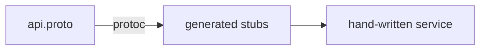

# Mode: Syntax/API

**Goal:** Decode the language idioms, framework APIs, and non-obvious usage in this repo, so a
reader who is fluent in programming but **not in this particular stack** can read the code
confidently. This is the "why does the code look like that?" lens.

## What to gather

- **Language idioms** — patterns specific to the language that a newcomer may not recognise (Go
  channels/`defer`/error wrapping, Python decorators/context managers/comprehensions, TS generics/
  discriminated unions, Rust lifetimes/`?`, Java streams/annotations/records).
- **Framework APIs** — the core APIs of the frameworks in use, and the house pattern for calling
  them (routing, DI, ORM queries, middleware, lifecycle hooks).
- **Macros / annotations / decorators / DSLs** — anything that generates behaviour that is not
  visible in the line itself (code generation, reflection, magic method names, config DSLs).
- **Generated code** — files that are produced by a tool, not hand-written (and how they are
  regenerated), so the reader does not edit them by hand.
- **Non-obvious usage** — clever or terse constructs that recur and would trip up a newcomer.

## How to investigate

- Identify the language(s) and framework versions from manifest files.
- Scan for the constructs above and pick the ones that actually appear a lot in this repo — do not
  give a generic language tutorial; teach *what this repo uses*.
- For each idiom/API, find a **real occurrence** in the repo and use it as the worked example.
- Spot generated code by headers ("DO NOT EDIT", "Code generated by ...") and by build config
  (`go:generate`, protobuf, OpenAPI generators, `@Generated`).
  ```bash
  grep -rEn "DO NOT EDIT|Code generated|go:generate|@Generated" <repo> | head
  ```

## Output structure

1. **Stack summary** — language(s), key frameworks, and versions.
2. **Idiom / API entries** — for each notable construct:
   - What it is, in one plain sentence.
   - A **real annotated snippet** from the repo (`file:line`), with inline comments explaining the
     non-obvious parts.
   - What a newcomer might wrongly assume it does.
3. **Generated code** — which files are generated, by what, and how to regenerate them.
4. **Optional flow diagram** — the Mermaid diagram (below), only when dispatch is non-obvious.
5. **Where to go next** + **Open questions / gaps**.

## Diagram

Usually annotated snippets carry this mode. Add a small `flowchart` **only when control or dispatch
flow is hidden** — e.g. a decorator/middleware chain, an event-to-handler mapping, or codegen
input→output — because that is exactly the part a newcomer cannot see from the syntax.



## Common pitfalls

- Do not write a language manual. Teach only the constructs this repo actually relies on.
- Always anchor an explanation to a real snippet — abstract descriptions do not help a newcomer
  read the next file.
- Flag generated files clearly so the reader never edits them by hand.
