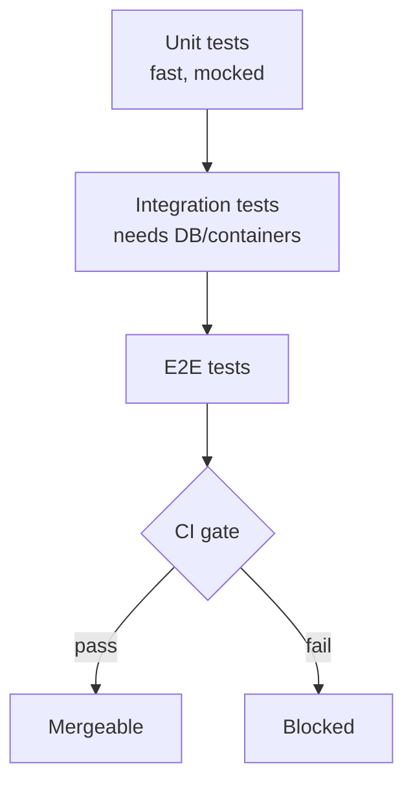

# Mode: Testing

**Goal:** Show how this repo is tested and with what — so the reader can run the suite, understand
what the tests prove, and write a new test that fits in.

## What to gather

- **Frameworks & runners** — the test framework(s) and how tests are invoked (`go test`, `pytest`,
  `jest`/`vitest`, `mvn test`/`gradle test`, `cargo test`).
- **Test types present** — unit, integration, contract, end-to-end, snapshot, property-based — and
  where each type lives.
- **How to run them** — the exact commands, including a single test/file, plus any prerequisites
  (a database, containers via testcontainers/docker-compose, env vars, fixtures/seed data).
- **Fixtures, mocks, factories** — how test data and doubles are created; the mocking library and
  the house pattern.
- **CI gates** — what CI runs and what must pass to merge (test job, coverage threshold, lint).
- **Coverage** — whether coverage is measured and roughly where it is strong or thin.

## How to investigate

- Locate tests and config:
  ```bash
  find <repo> -type f \( -name "*_test.*" -o -name "test_*.*" -o -name "*.spec.*" -o -name "*.test.*" \) | head
  ls <repo> | grep -Ei "jest|vitest|pytest|conftest|tox|Makefile|justfile"
  ```
- Read the CI config (`.github/workflows/*`, `.gitlab-ci.yml`, `Jenkinsfile`, `bitbucket-pipelines.yml`)
  to see the *authoritative* way tests are run and gated.
- Open 2–3 real tests to learn the house pattern: arrange/act/assert shape, fixtures, mocks, naming.
- Note prerequisites: does the suite need a live dependency, or is everything mocked?

## Output structure

1. **Testing landscape** — frameworks, test types, and where each lives (short table).
2. **How to run** — copy-pasteable commands: full suite, one file, one test, plus prerequisites.
3. **Patterns** — fixtures/factories/mocks, with one real annotated example (`file:line`).
4. **CI gates** — what must pass to merge, and where it is configured.
5. **Test-flow diagram** — the Mermaid diagram (below).
6. **Recipe: "How to write a new test"** — the steps and the file it goes in, from an existing example.
7. **Where to go next** + **Open questions / gaps** (call out thin coverage here).

## Diagram

A `flowchart` of the **test pyramid / how a run flows through the suites and CI gates** — from local
run through the suites to the merge gate. Base nodes on the real jobs and directories you found.



## Common pitfalls

- Get the run command from CI/Makefile, not from a guess — the real command often sets env/flags.
- If there is **no test suite**, say so directly; do not pretend. Report what exists (or note the
  absence as the key finding) and where tests would go.
- Distinguish "tests exist" from "tests pass" — do not claim the suite is green unless you ran it.
